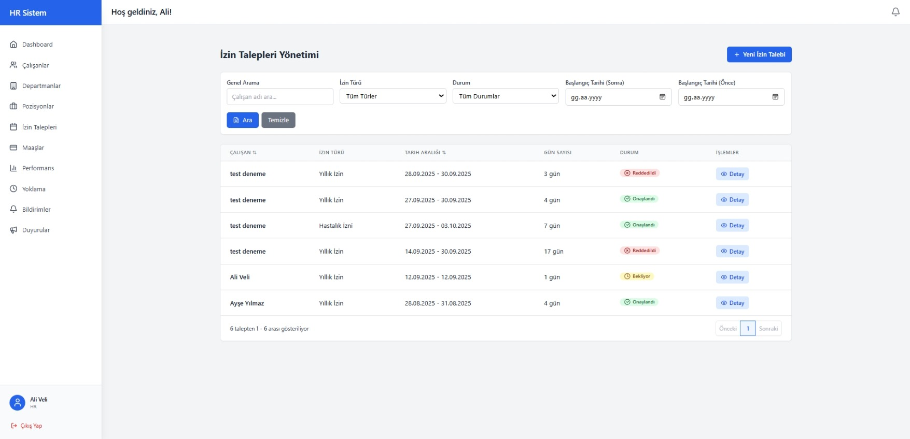
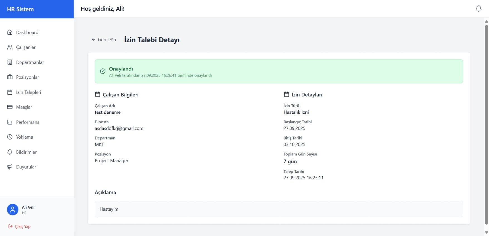

# HR Management System – Frontend (AI Assisted)
This frontend was created primarily for showcasing UI and UX of the HR Management System.
It is not intended for production use, but demonstrates AI-assisted component generation and design integration.

## Screenshots

More screenshots

  

